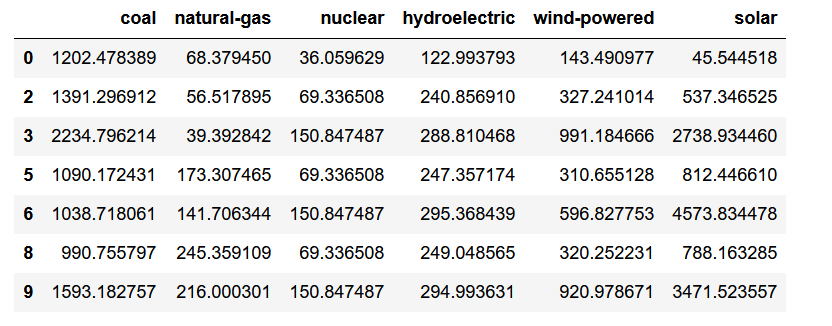
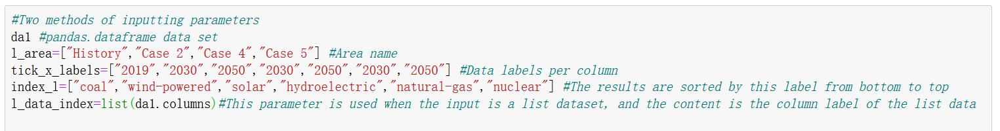
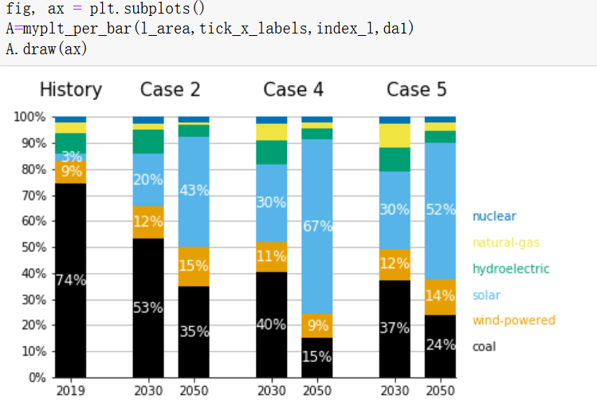
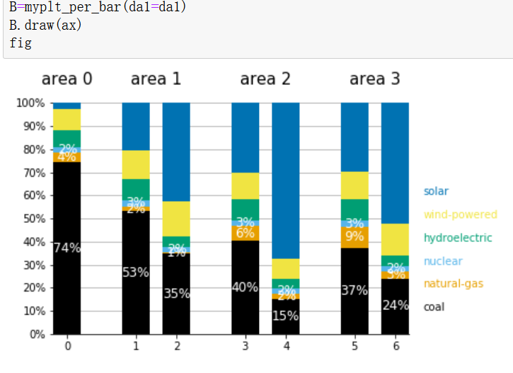
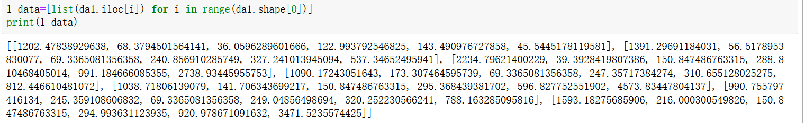
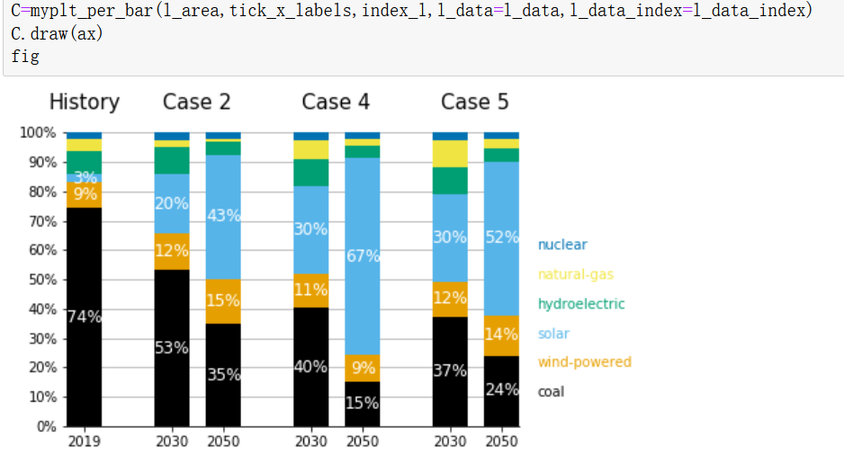
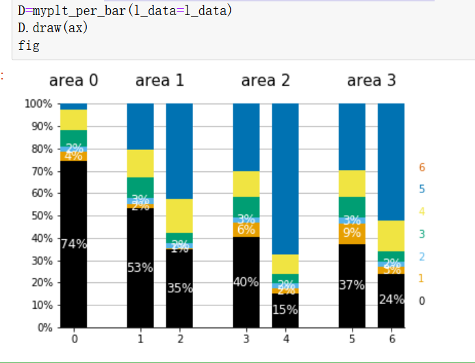
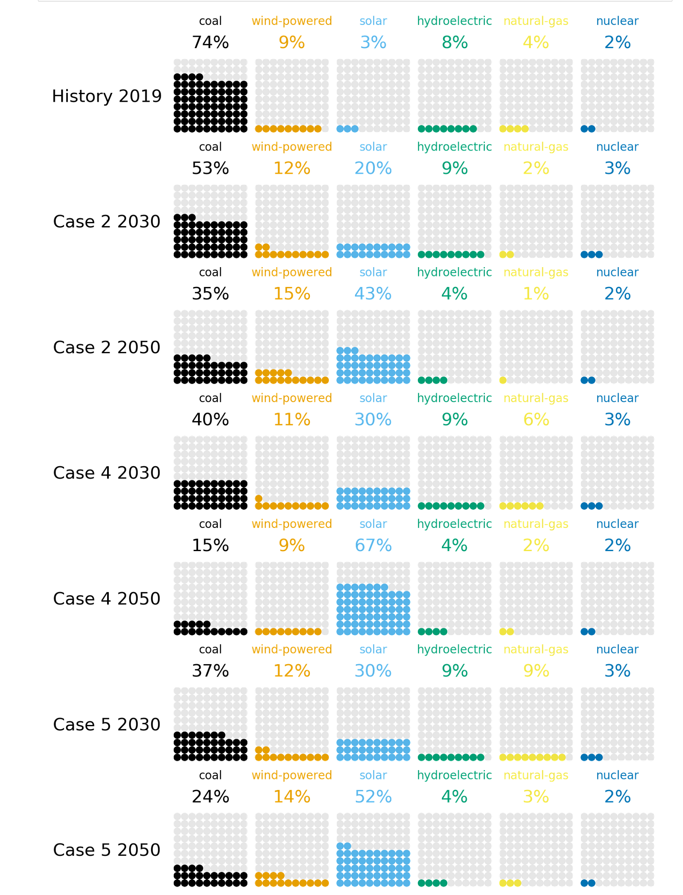

<font size="6">Group 38 Work Report</font><br />

---
GROUP 38
Yan Miao  ID:320180940711
Jiale Xu  ID:320180940401
Yueze Liu ID:320180940071
Yichen Li ID:320180939961


---
[TOC]

# Abstract

First of all, this article first describes the background significance and social impact of the data set we have selected. It describes the impact of different power generation methods by summarizing the economic benefits and environmental significance of different power generation methods, and briefly outlines the prediction of different regions through models India’s power generation share in 2030 and 2050 under the terms of inter-electricity trade.
Secondly, this article outlines the visual variables in the data visualization content that we need to reproduce, and analyzes the data visualization content according to various cognitive theories, and more clearly tells readers how to read the data visualization content.
The third point is that this article reproduces the above data visualization content and provides a logical block diagram of the code. This article will use examples to tell readers how to use our code to achieve the above data visualization content. This article provides a face to the data set A variety of visualization schemes for different data input methods, and tells about the problems and solutions faced in the reproduction process.
The fourth point is to improve the data visualization content based on the advantages and disadvantages mentioned above, and make a brand new data visualization content. And through the analysis of the data visualization content, the conclusion of the data set analysis is obtained.
Finally, We shared our results in the Github community.

## **1.The meaning of the data set**
What we chose this time is the influence of India's inter-regional power trade on future fuel selection for power generation. That is, by simulating India's inter-regional power trade under different conditions, we can predict the proportion of electricity generated by various power generation fuels in India in 2030 and 2050.
As electricity consumption grows, India is expanding its transmission infrastructure to allow electricity trade between regions of the country. The development of India's power transmission infrastructure may affect its power generation expansion decisions, especially in the long run, which will affect its long-term fuel demand. In this analysis, the data set considers how inter-regional grid connections affect India’s future fuel choices for power generation, especially the correlation between the increase in renewable energy generation and the transmission limit.
This data set was chosen because our group believes that studying this problem can bring about a better social impact. Through various channels, we have found that people are paying more and more attention to the impact of power generation fuel and regional power supply on the environment and economy. By consulting relevant data, it is found that the evaluation system of wind power, photovoltaic power generation and coal-fired power generation is established, and the environmental load is studied and compared and analyzed. The results show that: during the power generation operation stage, the carbon footprint of photovoltaic power generation is almost zero, and the carbon footprint of wind power generation is almost zero. 0.2g/(kW·h), the carbon footprint of coal-fired generating units is the highest, at 83.3g/(kW·h). The largest impact on global warming is coal-fired power generation, which is 3.63×10-5 standard equivalent, with the least impact It is wind power, which is 7.9×10-7 standard equivalent; the most impact on environmental acidification is photovoltaic power generation, which is 6.7×10-6 standard equivalent, and the least impact is wind power, which is 1.6×10-7 standard equivalent; wind power The solid waste emissions of power generation and photovoltaic power generation are almost zero. Therefore, by analyzing the data set and establishing data visualization content, the content of the data set can be better displayed, so as to obtain relevant conclusions about the impact of India's regional power trade on fuel selection, which also helps We better understand the significance of environmental protection.


## **2.Analysis of data visualization content**
For the visualization of the data set, the original paper chose to use a percentage chart. This visual image conforms to the elements of the cognitive theory that we need to follow when creating information visualization. It has less information and is convenient for readers to quickly browse and learn about the important Information, for understanding the proportion of different power generation fuels, the percentage chart also gives more intuitive information to let readers understand this problem. Moreover, the information that people get from the graph at a time is enough to understand the problem without exceeding the upper limit of his working memory, and the data visualization complies with the principle of procedural design.
Analyze this data visualization from a color perspective. For an analyst or reader who wants to get specific content from the data visualization, he will hope that the data visualization complies with the following three conditions. The colors need to be rich and meet the display in complex data scenarios. Don't use too much color. Because of the long-term reading, the colors are as soft as possible without glare. The classified colors need to be non-orientated, clear, identifiable, and harmonious, without causing a similar Stroop effect to mislead readers.

Data visualization is as follows:


## **3.Re-engraved data visualization content**
###3.1 Explanation of the code
(1)First you need to call the pandas package to read the data set
```python
import pandas as pd
import matplotlib.pyplot as plt
import numpy as np
import math
```
（2）For the re-engraving of the original data visualization content, we used the python programming language and various libraries contained therein. The following is the logic diagram of the program that we implemented the re-engraving:
```flow
st=>start: Store the input parameters in different attributes of the instance, and the undefined ones will be initialized in _inin()_
e=>end: Finally set the x-axis coordinate interval
op1=>operation: Realize data visualization of actual statistics in 2019
op2=>operation: List all the first row of data data and store it in h_l. If both dal and l_data are available, dal shall prevail.
op3=>operation: Divide each data in n-1 by the sum of the data in this row to get the percentage, which is counted as Out_l
After the double-layer for loop, the list data Out_l2 sorted by index_l label order is obtained,
Change the order of the tuple, get [(str) data class name, (int) data]
op4=>operation: Set the list variable l to store the actual y-coordinate of each column in the histogram (the y-axis coordinate of the lower left corner of the rectangle)
op5=>operation: Clear the canvas, set the y-axis interval and percentage label, 0.1 corresponds to 10%
op6=>operation: Remove the top, right and left borders of the canvas
op7=>operation: Draw multiple small rectangles with a width of 1 to the upper right outside x=0, and the first three rectangles are white in the center with a rounded percentage annotation. The drawing order is the order in Out_l2
op8=>operation: Add the comment of the area name in l_area[0] at (0.5, 1.1) outside the chart
op9=>operation: Draw the image of the subsequent prediction model
op10=>operation: The principle is the same as before, and then add the float variable position_x=0
op11=>operation: position_x is the lower x-axis coordinate data of the lower left corner of each histogram, following the odd-numbered histogram +2.5, and the even-numbered histogram +2.5
op12=>operation: After drawing all the rectangles, the for loop will add the index tag in the text annotation method at x=13.5.
st->op1->op2->op3->op4->op5->op6->op7->op8->op9->op10->op11->op12->e

```
###3.2 Difficulties and solutions in the process of reprinting data visualization
(1) The original code is a step-by-step depiction of the original data visualization image. The code is very repetitive and cumbersome. Later, by merging the same steps through the for loop, the code is more concise, easy to understand, and more robust.
(2) Because each subgraph of the data visualization implemented this time needs to add a title, if the method of adding a title using matplotlib cannot meet the demand, you can only add a general title above the entire data visualization chart, so the text method is used Add notes at the top of each sub-diagram to achieve the requirements.


## **4.User manual**
We have designed different usage methods for the situations where users may give different data input methods. The following are different usage examples given different data input methods.
### 4.1Provide pandas.dataframe dataset directly
(1)Data set example and import method



(2)Data visualization results

Given parameter l_ area，tick_ x_ labels，index_ l and data set da1.



Only given data set da1, l_ area and ick_ x_ labels default to count, index_ l is the da1 parameter by default.



### 4.2 Provide solutions for multi-dimensional list data sets
(1)Data import method

(2)Data visualization results

Given list dataset l_ data, parameter l_ area,tick_ x_ labels and index_ l. And l_ data_ index (this is l_ column label parameter of data).



Only given data set l_data, other parameters are default.



## **5.Advantages and disadvantages analysis and improvement methods**
### 5.1 Analysis of advantages and disadvantages
advantage:
(1) A percentage chart is used, and only three accurate percentage figures are given. This makes the information in the picture intuitive but the amount of information given at one time will not exceed the working memory of ordinary people, so it conforms to the cognitive theory.
(2) The percentage chart uses a variety of colors to distinguish the proportions of different types of power generation fuels, but the colors are not too many so as to meet the visualization and requirements of complex scenes without cumbersome. The color in the picture is soft and not glaring, and it is not misleading, which is convenient for long-term researchers to read for a long time and get more information.
Disadvantages:
The degree of intuition is still not enough. For example, if the proportions are too close for the parts without specific percentage values, it is difficult to determine the actual proportion, and it is not easy for researchers to directly compare the two.
### 5.2 Specific improvement methods (Waffle Chart)
This article uses the more intuitive and clear Waffle Chart in the category of percentage charts. This chart makes it easier for researchers to obtain various types of information from the chart, and it is also easier to compare the size relationship between the various parts. It is helpful for researchers to know the quantitative relationship of percentages more accurately.
### 5.3 Drawing logic of Waffle Chart
```flow
st=>start: Draw in the form of a subgraph, data_l is list form data, where the data is processed percentage data, int type
e=>end: Finally, add a row label comment before the first subgraph of each row
op1=>operation: Icon coordinate axis processing, all set to (0, 100), no coordinate axis, no frame
op2=>operation: Add the comment of data_l percentage data and index tag to the corresponding position above each subgraph
op3=>operation: Double-layer for loop, traverse the columns first, then traverse the rows, and fill small circles in the corresponding positions in turn, the first data_l[i][j] circles are the corresponding colors, and the rest are gray
op4=>operation: Set the list variable l to store the actual y-axis coordinate of each column in the histogram (the y-axis coordinate of the lower left corner of the rectangle)

st->op1->op2->op3->op4->e
```
### 5.4 Data visualization of Waffle Chart
(1)Import of data sets


(2)Data visualization results




## **6. Conclusions obtained through data visualization**
Between 2010 and 2019, India’s electricity consumption has doubled, and we expect electricity consumption to continue to increase due to projected economic and population growth. Grid interconnection may play a role in India's plan to increase its power generation and transmission capacity, especially in the interrelationship between existing coal capacity and new renewable energy capacity.

In order to analyze the impact of inter-regional power trade on capacity expansion decisions affecting the fuel structure of power generation, models were established for five different situations. The analysis should be further improved in view of the power generation costs and power demand patterns of specific regions in the Indian power market to improve the representativeness of potential economic factors in the market. The results show that modeling India as a single unified power market (Case 1) and as five regional power markets (Case 2) will produce some differences in the fuel mix for power generation, because the access to renewable resources in Case 1 is not subject to intermittent The restrictions and restrictions have prompted the growth of low-cost power generation, especially solar power generation. In the case of different costs and load shapes (case 3), electricity transactions occurred in all five modelled electricity markets. Cost-competitive power generation technologies (such as solar and wind power) have replaced technologies that use fossil fuels in power generation mixtures.

## **7. Share our results in the community**
We shared our results in the Github community, and the link is below.

[github link](https://github.com/MiaoIsMe/Percentage-chart)


## **References**
[1] MANUSSAWEE SUKUNTA.Interregional Electricity Trade in India[N].INTERNATIONAL ENERGY OUTLOOK 2020. October 14, 2020
[2] 关于数据可视化设计中色彩的一些思考. https://zhuanlan.zhihu.com/p/35257864